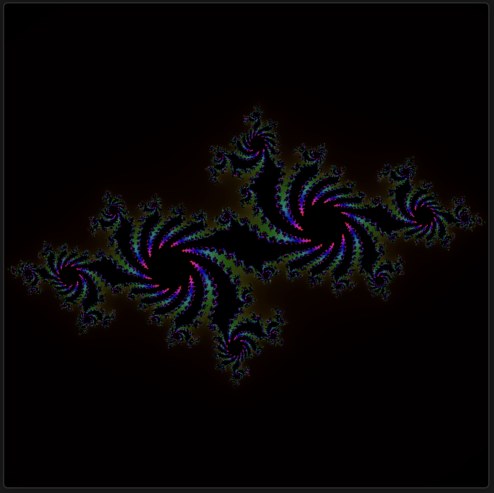

# Fractal Visualizer
[WEEKEND HOBBY PROJECT]

An interactive web application built with React and p5.js that allows users to explore and visualize various types of mathematical fractals in real-time.



## Requirements
- Node.js (version 14 or higher recommended)
- Modern web browser with canvas support
- NPM or Yarn package manager

## Getting Started
1. Clone the repository
2. Install dependencies:
```bash
npm install
```

3. Start the development server:
```bash
npm run dev
```

## Features
This application includes visualizations for seven different types of fractals:

- **Mandelbrot Set**: The classic fractal set of complex numbers defined by iterating z² + c
- **Julia Set**: A related fractal to the Mandelbrot set, showing intricate boundary patterns
- **Newton Fractal**: Based on Newton's method for finding roots of complex polynomials
- **Sierpinski Triangle**: A self-similar fractal composed of triangles
- **Koch Snowflake**: A fractal curve made up of equilateral triangles
- **Dragon Curve**: A recursive curve that creates intricate dragon-like patterns
- **Barnsley Fern**: A fractal that resembles a natural fern, created using an iterated function system

## Interactive Controls
Users can:
- Select different fractal types from a dropdown menu
- Adjust the number of iterations (1-200) to control detail level
- Modify the recursion depth (1-12) for geometric fractals
- View real-time updates as parameters change

## Technical Details
Built using:
- React for the UI components and state management
- p5.js for fractal rendering and visualization
- Vite for fast development and building
- Tailwind CSS for styling
